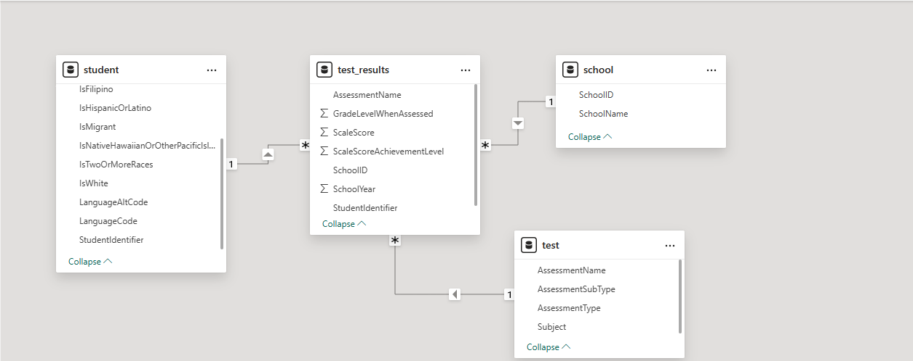
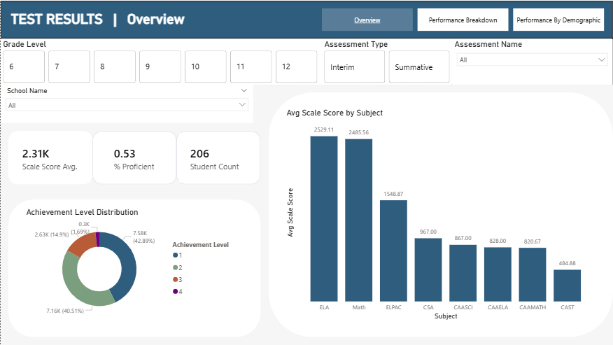
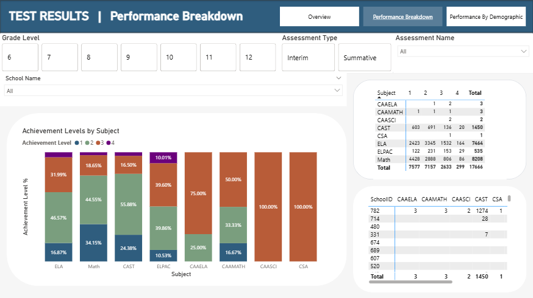
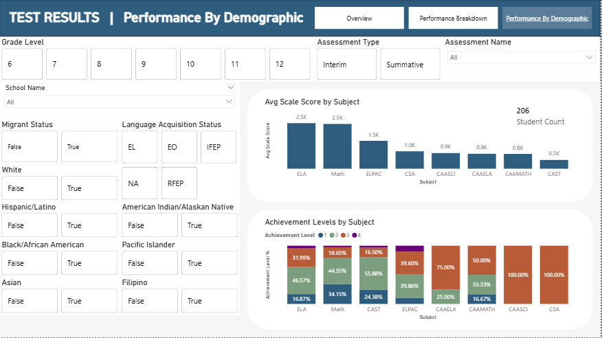
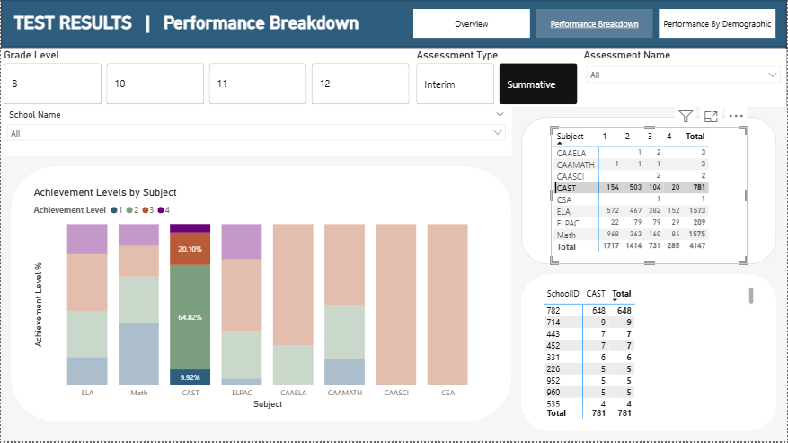

# Student Assessment Performance Dashboard (Power BI)

## Overview

This project presents an interactive Power BI dashboard for analyzing student assessment performance across schools, grade levels, and demographic groups.

The goal of the report is to support decision-making by enabling users to:

-   Monitor overall performance trends over time
-   Compare performance across schools and student groups
-   Analyze achievement level distributions
-   Identify areas with low proficiency rates

------------------------------------------------------------------------

## Business Questions Answered

This report is designed to answer practical questions such as:

-   **How are students performing overall?**

    -   What is the average scale score and overall proficiency rate?

-   **Which schools are performing above or below expectations?**

    -   How does performance vary across schools when controlling for grade level and assessment type?

-   **Are there performance gaps between student groups?**

    -   How do achievement levels differ across demographic categories?

-   **How is performance changing over time?**

    -   Are proficiency rates improving, declining, or stable year-over-year?

-   **Where should intervention efforts be focused?**

    -   Which schools or groups have the highest concentration of low achievement levels?

------------------------------------------------------------------------

## Key Metrics

-   **Average Scale Score**
-   **% Proficient (Levels 3–4)**
-   **Student Count**
-   **Achievement Level Distribution**

------------------------------------------------------------------------

## Data Pipeline & Modeling

Data was transformed upstream using SQL (DuckDB) into a clean star schema:

-   **Fact Table**

    -   `test_results`

-   **Dimension Tables**

    -   `student`
    -   `school`
    -   `test`

All joins, deduplication, and normalization were handled in SQL prior to loading into Power BI. This minimizes transformation in the reporting layer and ensures consistent, reliable metrics.

------------------------------------------------------------------------

## Power BI Report Design

The report was designed with a focus on usability and clarity:

-   Consistent page layout with a structured navigation system
-   Global slicers for filtering by year, grade level, and assessment
-   Clear visual hierarchy using card-based layouts
-   Minimal visual clutter to prioritize interpretability

------------------------------------------------------------------------

## Features

-   Interactive filtering across all report pages
-   Page navigation using a unified navigation bar
-   Drill-down analysis by school and demographic group
-   Dynamic measures using DAX (e.g., % Proficient)
-   Responsive visuals for comparative and distribution analysis

------------------------------------------------------------------------

## Repository Structure

```         
/report
  test_results_report.pbix

/src
  01_init.sql
  02_import.sql
  03_dimensions.sql
  04_fact.sql
  05_export.sql

/images
  overview_pages.png
  performance_breakdown.png
  performance_by_demographic.png
  filters_in_action.png
  snowflake_model_of_test_results.png
  
/data
  portfolio_test_data.csv
  
/sql_outputs
  
```
------------------------------------------------------------------------
## Screenshots

### Model


<div align="center">
  
</div>

### Overview

<div align="center">
  
</div>

### School Performance

<div align="center">
  
</div>

### Demographic Analysis

<div align="center">
  
</div>

### Filters Applied Example


<div align="center">
  
</div>


------------------------------------------------------------------------

## Tools & Technologies

-   Power BI
-   SQL (DuckDB)

------------------------------------------------------------------------

## Notes

This project emphasizes a **SQL-first data modeling approach**, where data shaping is performed upstream and the BI layer is used primarily for semantic modeling and visualization.

The report is designed to reflect real-world reporting scenarios where clarity, consistency, and maintainability are prioritized over visual complexity.
